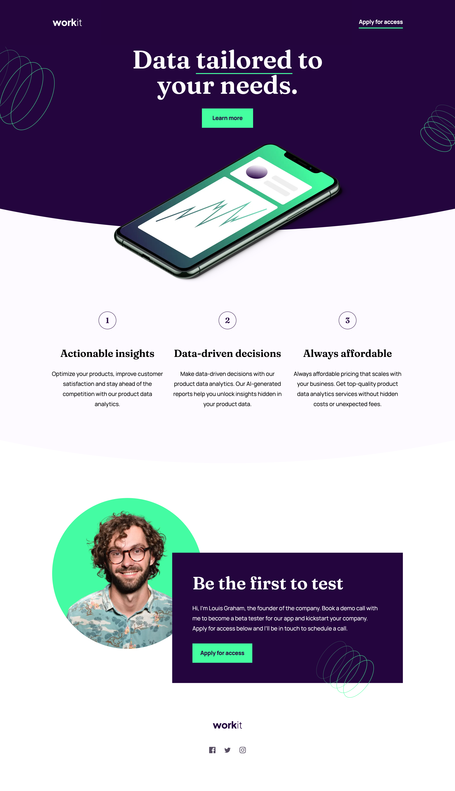

# Workit landing page

This is a solution to the [workit landing page challenge on Frontend Mentor](https://www.frontendmentor.io/challenges/workit-landing-page-2fYnyle5lu). Frontend Mentor challenges help you improve your coding skills by building realistic projects.

- [The challenge](#the-challenge)
- [Screenshot](#screenshot)
- [Links](#links)
- [Built with](#built-with)
- [Author](#author)

## The challenge

Users should be able to:

- View the optimal layout for the interface depending on their device's screen size
- See hover and focus states for all interactive elements on the page

## Screenshot

## Links

- [Solution URL](https://github.com/annaindistress/frontend-mentor-workit-landing-page)
- [Live Site URL](https://annaindistress.github.io/frontend-mentor-workit-landing-page/)

## Built with

- Semantic HTML5 markup
- Flexbox
- CSS Grid
- Mobile-first workflow
- Vite
- PostCSS
- SVG Sprite

## Author

- Frontend Mentor - [@annaindistress](https://www.frontendmentor.io/profile/annaindistress)
- Twitter - [@annaindistress](https://www.twitter.com/annaindistress)
